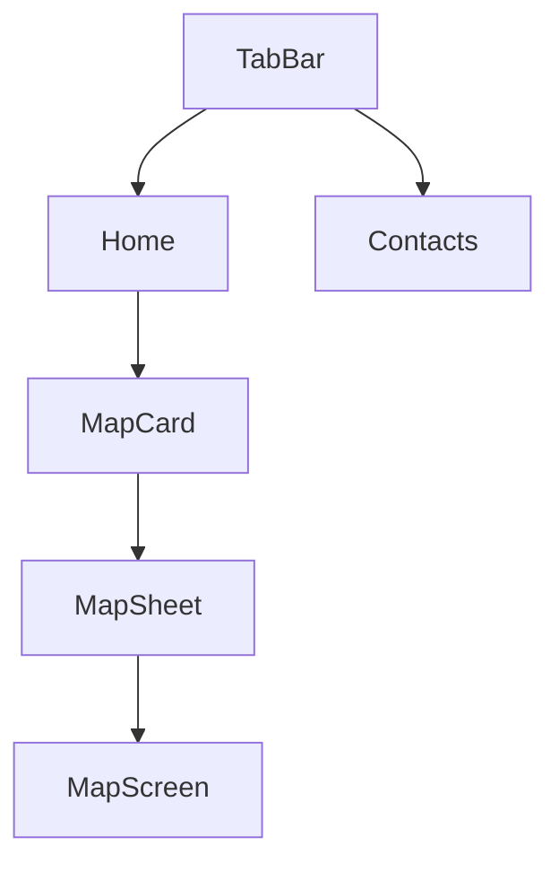

## Navigation and Map Flow

### What changed
- **Before**: The Map lived as its own tab in the bottom `TabView`.
- **Now**: The Map is accessed from **Home** via a **Map preview card**. Tapping the card opens the full map experience in a **bottom sheet**.

### Why
- Keeps the primary navigation focused (Home + Contacts).
- Makes the map feel like contextual information (a “card”) rather than a separate destination.
- Allows quick access to the map while staying in the Home flow.

### User flow

### Ownership and architecture (MV)
- **Models/Logic**
  - `ContactLocationService` (Models): geocoding + caching + region fitting.
  - `ContactAnnotation` (Models): annotation representation used by map rendering.
- **Views**
  - `MapPreviewCard` (Views): Home card UI, single glass container around header + preview map.
  - `MapPreviewMap` (Views): non-interactive preview map (no filter UI).
- **Screens**
  - `HomeScreen` (Screens): owns presentation state for the map sheet (`showMapSheet`).
  - `MapScreen` (Screens): full map experience (filters, refresh, pins), optionally shows a Close button when presented in a sheet.

### Notes
- Both `MapScreen` and `MapPreviewMap` call `ContactLocationService.notifyMapReady()` when their map has a stable size. This prevents geocoding from running while the map is zero-sized, improving reliability and performance.

